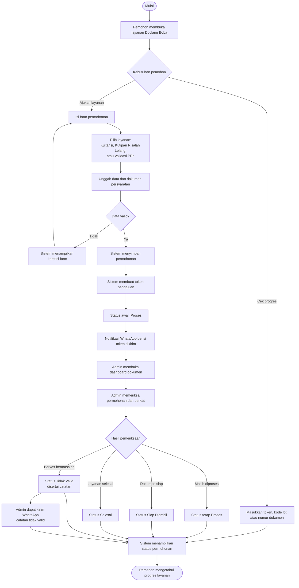
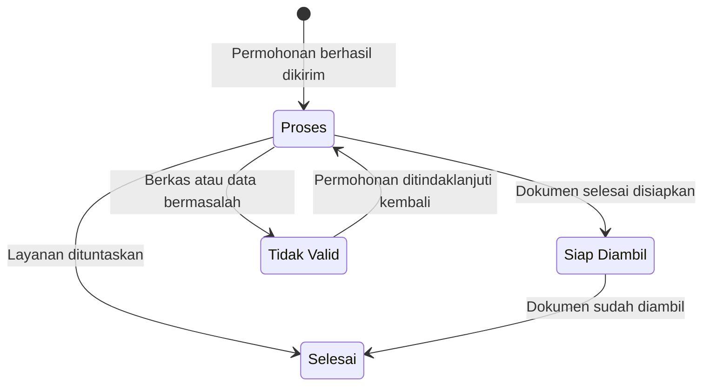

# Flowchart Presentasi Doclang Boba

File ini merangkum alur utama aplikasi berdasarkan proses yang terlihat pada kode:

- Pemohon mengajukan layanan dokumen melalui form publik.
- Sistem menyimpan permohonan, membuat token pengajuan, dan mengirim notifikasi WhatsApp awal.
- Admin memeriksa dan memperbarui status permohonan.
- Pemohon melacak progres dokumen dari halaman publik.
- Super admin mengelola akun admin.

## 1. Flowchart Utama

Diagram ini cocok dipakai sebagai slide utama karena hanya menampilkan aktor dan keputusan penting.

## 2. Alur Status Permohonan

Diagram ini cocok dipakai saat menjelaskan perubahan status dokumen.

## 3. Ringkasan Peran

| Aktor | Peran dalam alur |
| --- | --- |
| Pemohon | Mengisi form permohonan dan memantau status layanan. |
| Sistem | Memvalidasi data, menyimpan permohonan, membuat token, menampilkan status, dan mengirim notifikasi. |
| Admin | Memeriksa berkas, memperbarui status, dan mengirim catatan tidak valid jika diperlukan. |
| Super Admin | Mengelola akun admin yang dapat mengakses pengelolaan dokumen. |

## 4. Narasi Singkat untuk Presentasi

1. Pemohon memulai dari halaman layanan dan mengisi form permohonan sesuai jenis layanan yang dibutuhkan.
2. Sistem memeriksa kelengkapan data dan dokumen. Jika valid, permohonan disimpan dengan status awal `proses`.
3. Sistem membuat token pengajuan dan mengirimkannya melalui WhatsApp agar pemohon dapat melacak progres.
4. Admin memeriksa permohonan di dashboard, lalu mengubah status menjadi `siap_diambil`, `selesai`, atau `tidak_valid`.
5. Pemohon melihat progres melalui fitur pelacakan publik menggunakan token, kode lot, atau nomor dokumen.

## 5. Catatan Teknis Singkat

- Layanan utama yang terlihat pada aplikasi adalah `kuitansi`, `risalah_lelang`, dan `validasi_pph`.
- Status yang digunakan adalah `proses`, `siap_diambil`, `selesai`, dan `tidak_valid`.
- Saat permohonan dinyatakan `tidak_valid`, admin wajib mengisi catatan sebelum mengirim notifikasi WhatsApp.
